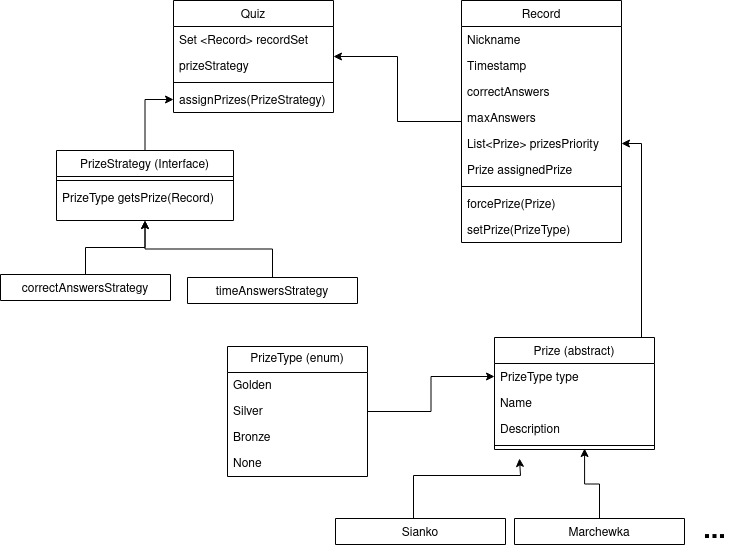
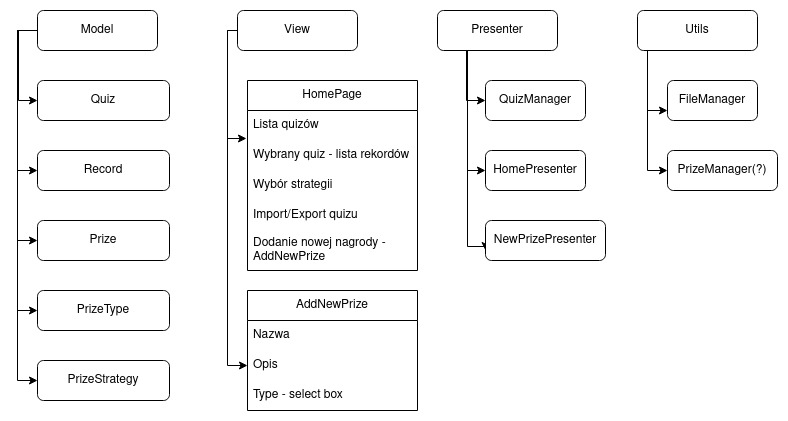
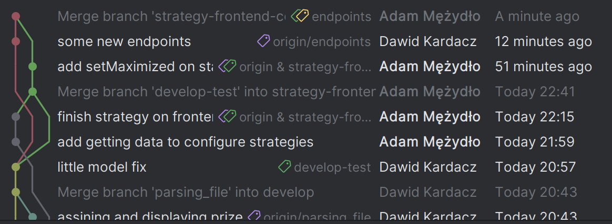

# quiz manager
Project made for Object-Oriented Technologies course at AGH University.

### functionalities:
Import quiz results from Object-Oriented Programming course lectures. Analyzes responses, assigns prizes and allows for export to .xlsx.

### technologies:
Spring Boot, REST API, Hibernate, JavaFX

 

## Changelog
### 07.12.23
 - podstawowy model danych
 - import plików działający w backendzie
 
### 14.12.23
 - działająca baza danych z przykładowymi danymi
 - endpointy w backendzie
 - pobieranie listy dostępnych quizów
 - wyświetlanie rekordów i wyników wybranego quizu

### 21.12.23
 - małe poprawki modelu danych
 
### 5.12.23
 - upload pliku
 - parsowanie danych z arkusza
 - przypisywanie nagród według strategii
 - widoki dodawania nagród, kategorii nagród oraz konfiguracji strategii (na razie brak połączenia z backendem)

## Uwagi
- podczas dodawania Quizu, nagrody będą mogły zostać przypisane, dlatego przed dodaniem Quizu nalezy upewnić się, że nagrody wraz z kategoriami są w bazie (na ten moment w bazie są testowe nagrody z kategoriami oraz nagrody wg. konspektu na repo kursu od PO)
- domyślnie wybierana jest pierwsza dostępna strategia, potem możliwość zmiany
- przy dodawaniu quizu możliwe, że operacja będzie trwała chwilę więc dla pewności zaleca się przeklikać między quizami

### SQLite
Baza danych znajduje się w backend/mydb.sqlite

### Model danych i aplikacji (do zmiany)
Model danych

Schemat aplikacji

Przejrzysta historia commitów

