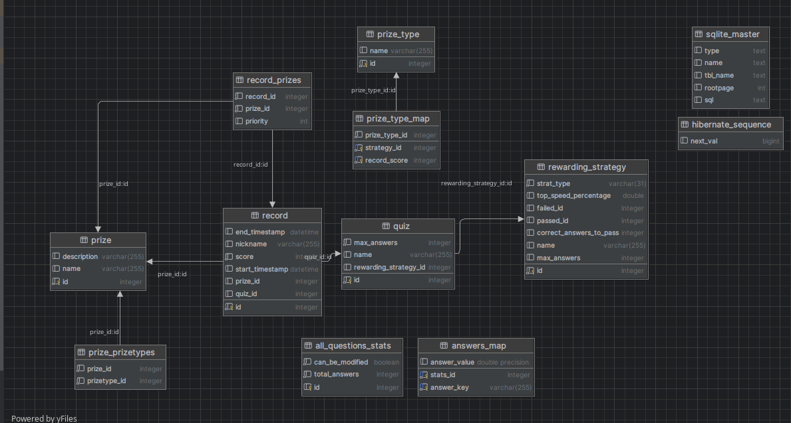

## [<- Go back](../README.md)

# Project Structure

Project contains two modules: `backend` and `frontend`.
Project structure is based on MVC (Model-View-Controller) pattern.

## Backend
### 1. M - Model
The Backend is written in Java using Spring Boot.
Data model is defined using Hibernate.
Data is stored in SQLite database.

### Data Model



### 2. C - Controller
Communication with the frontend is done using REST API.
This is handled by controllers in the `controller` package.
They use services in the `service` package, which in turn use repositories in the `repository` package.
Thanks to this, we have a division into layers, which makes it easier to manage the code.

### Different rewarding strategies - Visitor pattern
The application allows for assigning prizes based on different strategies.
Both of strategies implement the `RewardingStrategy` interface.
We also created the `RewardAssigner` class, which is responsible for assigning prizes based on the selected strategy.
However we faced the problem how to invoke the correct method in the strategy class, when operating on the `RewardingStrategy` interface.
The obvious solution would be to use the `instanceof` operator, but it is not recommended in object-oriented programming.
Therefore, we decided to use the Visitor pattern.
We created the `Visitor` interface, which contains methods for each strategy.
The `RewardAssigner` class extends the `Visitor` interface.
Now, the `RewardingStrategy` interface has a method that accepts a `Visitor` object.
When we call this method, the correct method from the `RewardAssigner` class is invoked.


### Example

Let's say we have a quiz that has a `CorrectAnswersRewardingStrategy` strategy.
We call `assignPrizes` method in the `RewardAssigner` class with the quiz as a parameter.
We get the strategy of a quiz and call the `accept` method on it with the `RewardAssigner` object as a parameter.

```java
public class RewardAssigner implements Visitor {
    //...
    public void assignPrizes(Quiz quiz) {
        RewardingStrategy rewardingStrategy = quiz.getRewardingStrategy();
        Prize nonePrize = prizeService.getNonePrize();

        rewardingStrategy.accept(this, quiz, nonePrize);
    }
}
```

Now, in the accept method, we call the correct method from the `RewardAssigner` class.

```java
public class CorrectAnswersRewardingStrategy extends RewardingStrategy{
    //...
    @Override
    public void accept(Visitor visitor, Quiz quiz, Prize nonePrize) {
        visitor.assignPrizesCorrectAnswers(this, quiz, nonePrize);
    }

}
```

This pattern allows us to avoid using the `instanceof` operator and makes the code more readable and easier to maintain.
If we wanted to add another strategy, we would only have to implement the `RewardingStrategy` interface and add a method in the `Visitor` interface.

### FileManager
The `FileManager` class is responsible for importing and exporting quiz results.
It uses the `Apache POI` library to read and write .xlsx files.

## Frontend
The frontend is written in Java using JavaFX.
It was imposed by the course to use JavaFX, if we could, we would probably use a different technology.

### 3. V - View
The frontend is divided into several views. Each view is a separate FXML file.
For styling we used CSS.
The views are controlled by presenters in the `presesnter` package.
The presenters use the `QuizService` class to communicate with the backend.
The `QuizService` class uses the `Retrofit` library to send requests to the REST API.

