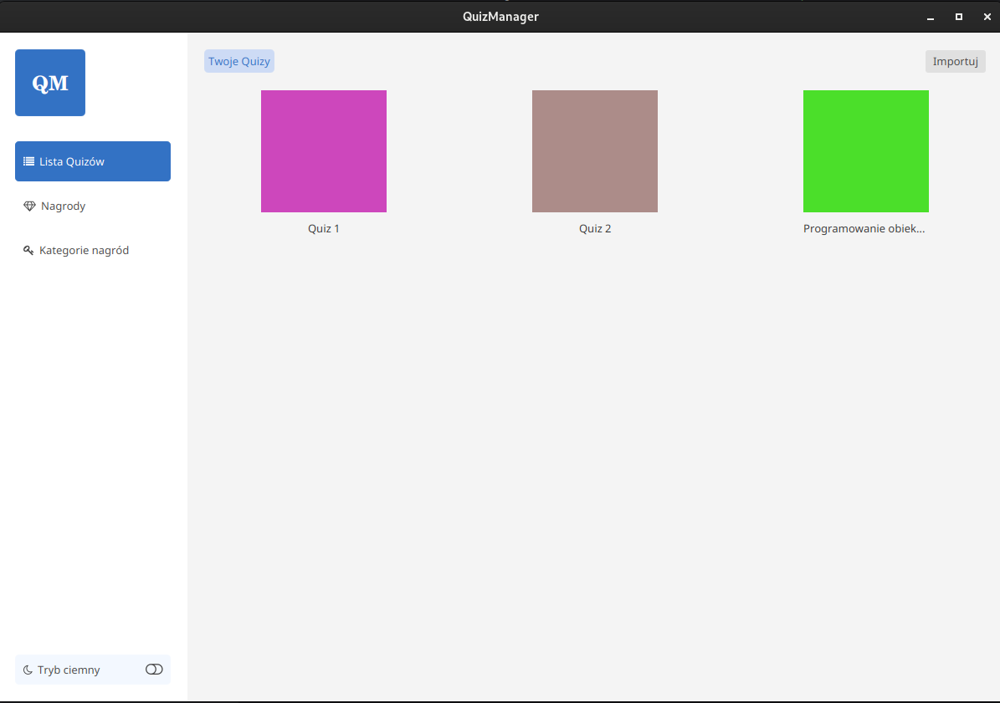
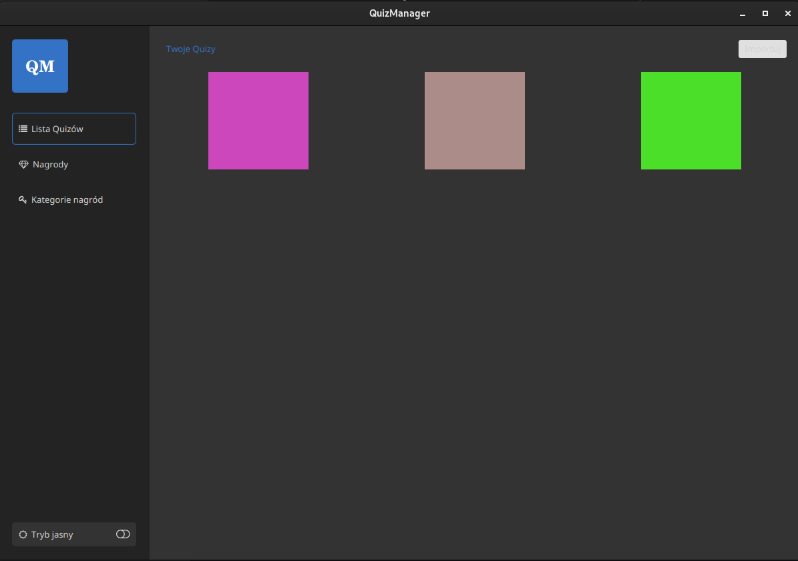
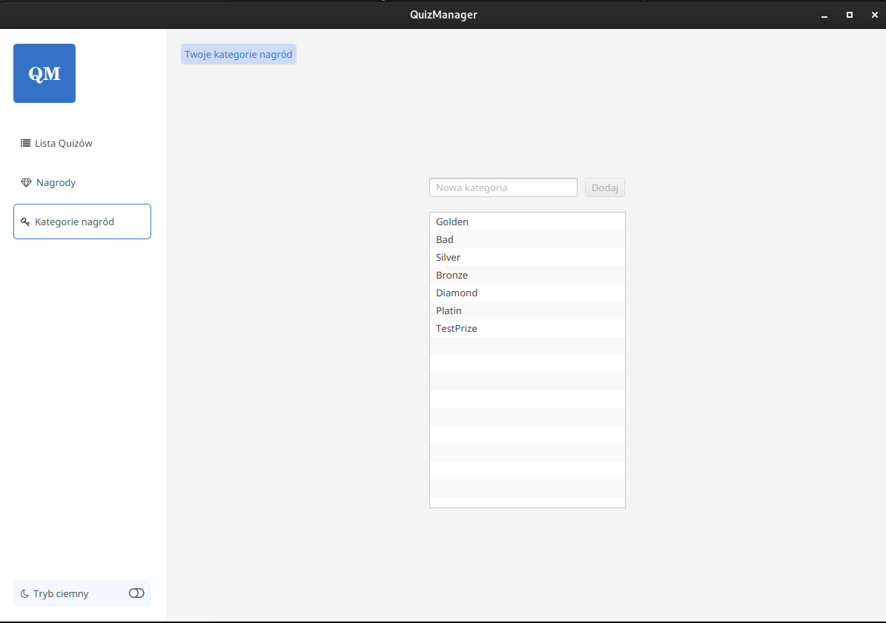
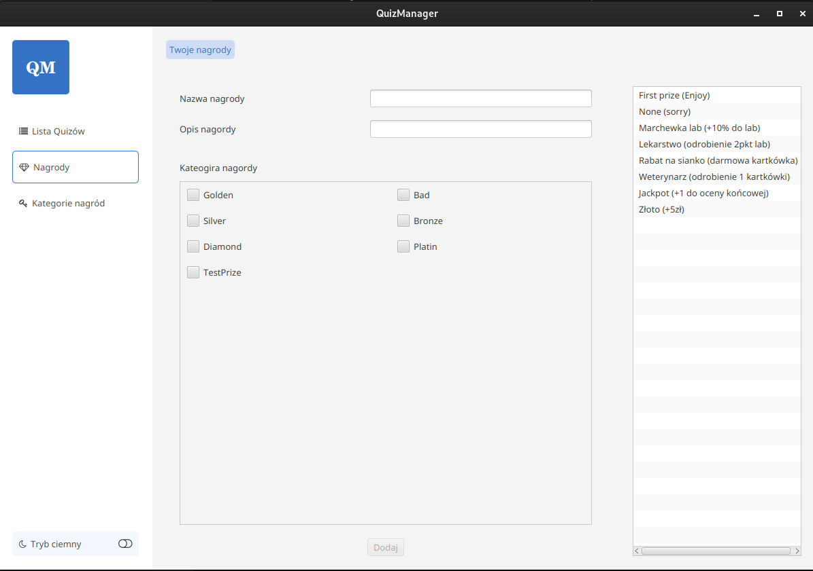
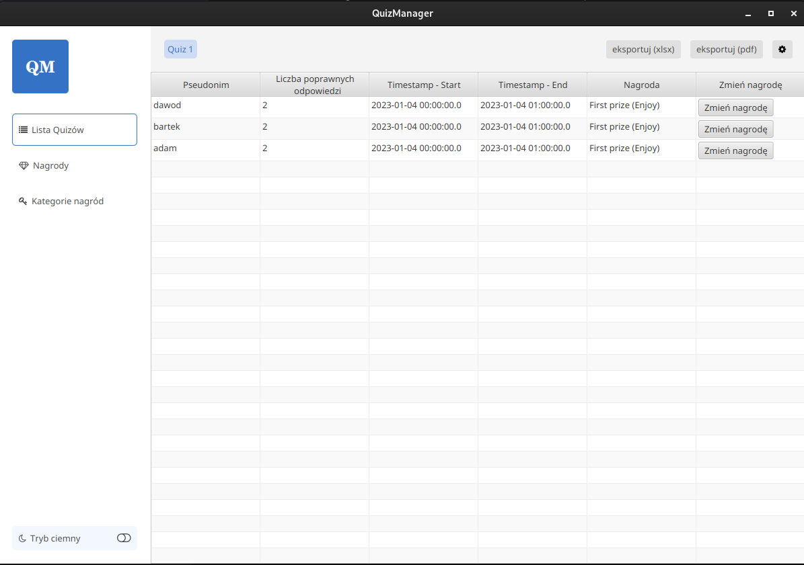
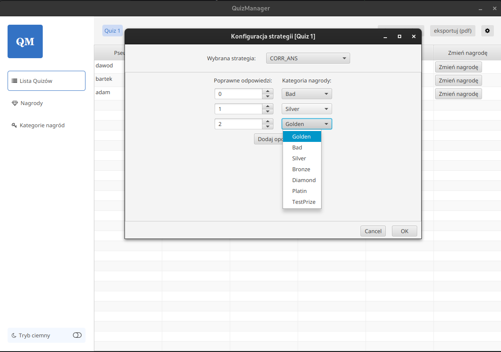
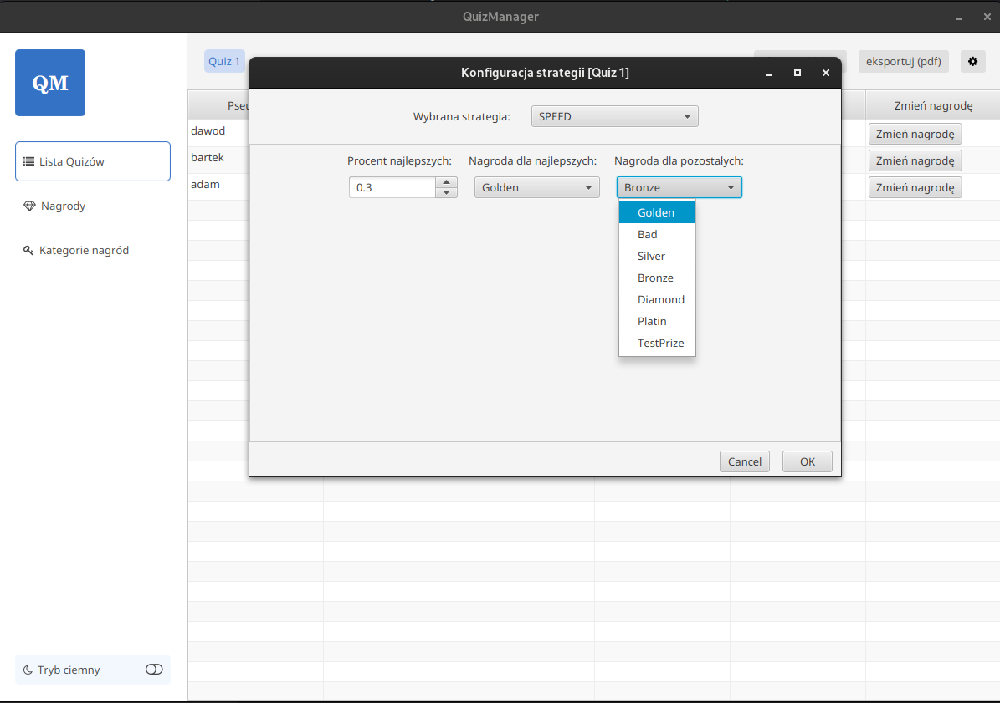
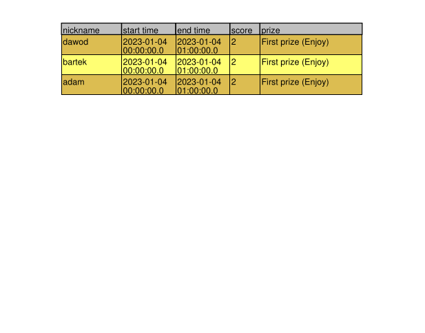

## [<- Go back](../README.md)

# Screenshots

## Main View - Quiz List
- List of already imported quizzes
- Import new quiz

### Dark mode (to improve/fix)

## Prize Category List View
- Add new prize category

## Prize List View
- Add new prize with the possibility of assigning multiple categories

## Quiz Results View
- List of students with their quiz results
- Assigning prizes based on the selected strategy
- Changing the prize assigned to a student
- Exporting quiz results to .xlsx or .pdf file
- Changing and configuring strategies

## Strategy Configuration View
- Changing the values and prize categories for both strategies
  - SPEED - top x% students with the shortest time get a prize from category A, the rest get a prize from category B
  - SCORE - students who got x points get a prize from category A, then students who got y points get a prize from category B, etc.

  

## Quiz Results in a PDF file
